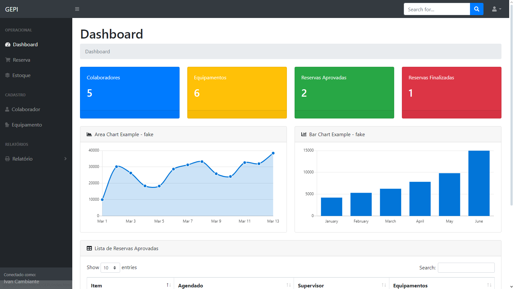
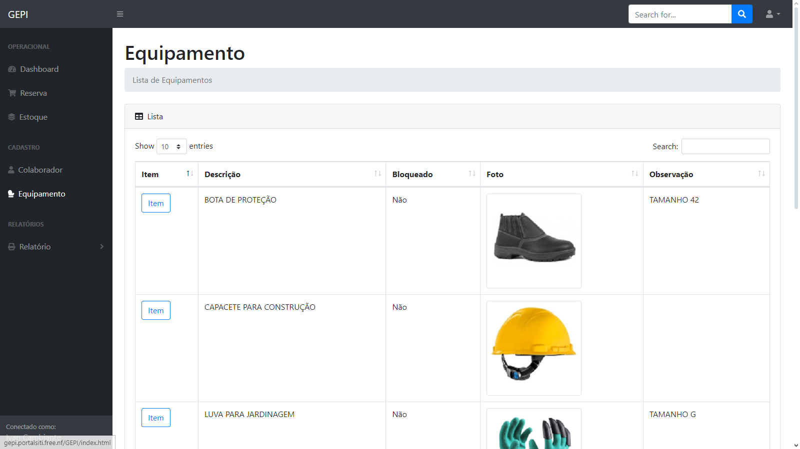
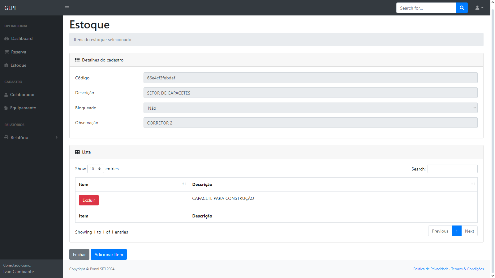
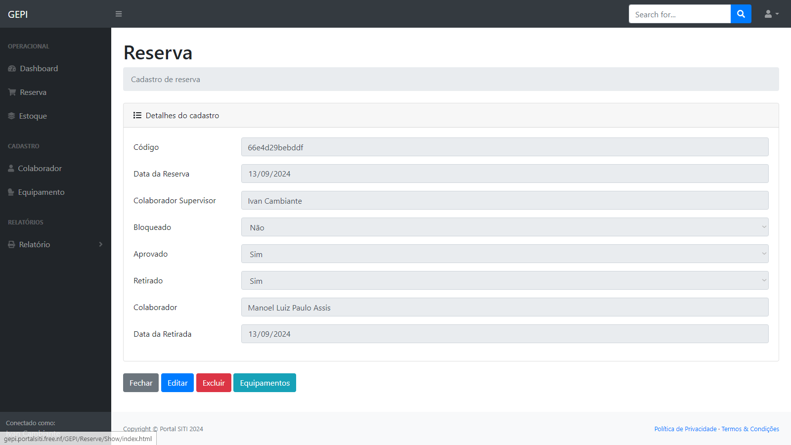
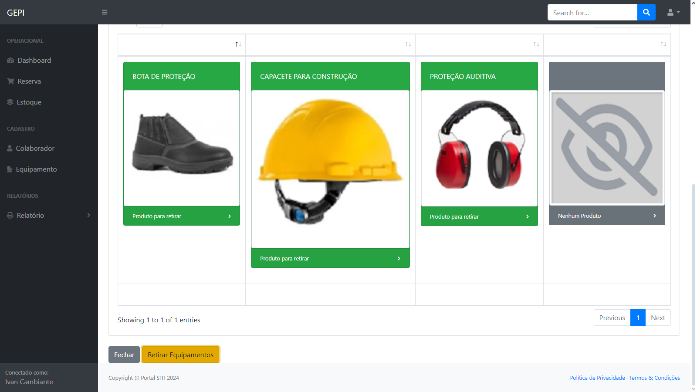

# GEPI
 ### Gerenciamento de EPIs.

Software de Gestão – Gerenciamento de EPIs

## Protótipo Modelo de Software – GEPI
Com a finalidade de apresentar a implementação de uma ou mais tecnologias, esta proposta não tem finalidade comercial.

## Descrição Geral
### Sistema de controle de estoque para equipamentos de EPIs:

Sistema para gerenciar o processo de reserva de equipamentos, registro de retiradas de equipamentos e visão do fluxo do estoque.

## Representação Operacional
O colaborador supervisor da empresa será responsável por realizar a reserva dos equipamentos a serem retirados por um outro colaborador. O supervisor visualizará no sistema os equipamentos adicionando a um carrinho gerando um pedido de reserva de equipamento. Outro colaborador fará a consulta destas reservas e informará sua credencial para registrar a retirada deste pedido.

O sistema sinalizará em um controle de estoque que os equipamentos foram baixados do estoque e este histórico ficará acessível para geração dos relatórios do moviento do estoque.

<table>
  <tr>
    <td>
    <h3>Dashboard</h3>
      
    </td>
  </tr>
  <tr>
    <td>
    <h3>Equipamento</h3>
      
    </td>
  </tr>
  <tr>
    <td>
    <h3>Estoque</h3>
      
    </td>
  </tr>
  <tr>
    <td>
    <h3>Reserva</h3>
      
    </td>
  </tr>
  <tr>
    <td>
    <h3>Retirada</h3>
      
    </td>
  </tr>
  <tr>
    <td>
      <a href="http://gepi.portalsiti.free.nf/GEPI/Login/" target="_blank">VER Demonstra&ccedil;&atilde;o</a>
    </td>
  </tr>
</table>

## Funcionalidades
* Cadastro dos equipamentos com foto e descrição.
* Interface simples e limpa para selecionar. Exemplo como uma loja online 
de equipamentos.
* Controle de estoque
* Cadastro de colaboradores e assinatura por biometria
* Relatórios gerais de estoque e por equipamento
* Relatórios com histórico por colaborador colapsar

## Requisitos de Implementação
* Requer hospedagem de site em PHP.
* Requer hospedagem banco de dados MySQL.

## Cronograma
O desenvolvimento da solução requer o total de 40 horas.

## Suporte ao Produto
Esta proposta não tem valor comercial.

## Condições Gerais
Esta proposta não tem valor comercial.

## Considerações Finais
O sistema ora proposto é passível de expansão e adaptável às necessidades específicas da área de negócios do cliente. Logomarcas, fotos, ilustrações e textos, são de responsabilidade da contratante, devem ser apresentados dentro das datas negociadas de comum acordo entre as partes, para que possamos cumprir rigorosamente o cronograma de desenvolvimento e consequente entrega do projeto na data programada, constante neste documento.
